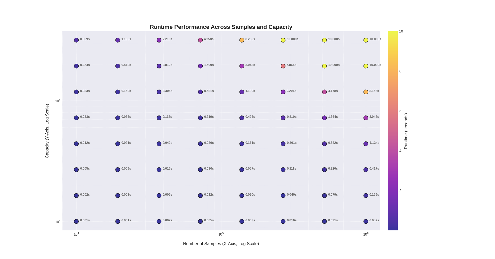

# Approximate Subset Sum

Find fast approximate solutions for the [subset sum problem](https://en.wikipedia.org/wiki/Subset_sum_problem).

## Installation
```sh
pip install approx_subsetsum
```

## Usage
Given an integer numpy array `samples`, this function tries to find a subset of `samples`, that has a sum close to a given `capacity`.

```py
import numpy as np
from approx_subsetsum import subsetsum

samples = np.array([1, 2, 3, 4, 5])
capacity = 7
indices = subsetsum(samples, capacity, timeout=10.0, allow_higher=100)
solution = samples[indices]
if np.sum(solution) == capacity:
    print('found solution')
else:
    print('solution is off by', abs(np.sum(solution) - capacity))
```

### Parameters
- `samples`: The input array of integers. Fastest if given as numpy array (no copy). Otherwise the data will be copied.
- `capacity`: The target sum as integer. High capacities can lead to high memory usage and runtime.
- `timeout`: The maximum runtime in seconds. If the algorithm does not find a solution within this time, it throws a `approx_subsetsum.TimeoutError`.
- `allow_higher`: If set to a positive integer, the algorithm will also try to find a solution higher than `capacity` (up to `capacity + allow_higher`). Note that setting `allow_higher` to a large value can hurt performance.

## Performance
The algorithm is not well optimized, but at least implemented in C++.

For the following measurements, a script similar to the following code snippet was executed:
```py
import numpy as np
from approx_subsetsum import subsetsum

def bench(n_samples, capacity):
    samples = np.random.randint(1, 1000000, n_samples)
    subsetsum(samples, capacity, timeout=10.0)
```

The plot shows the runtime depending on the number of samples and the capacity.

*Note: The algorithm timed out after 10 seconds.*

The following table shows an overview of the runtimes (of course, this depends on the hardware).

| #samples | capacity | runtime    |
|----------|----------|------------|
| 1000     | 10000    | 0.000 secs |
| 10000    | 10000    | 0.001 secs |
| 100000   | 10000    | 0.006 secs |
| 1000000  | 10000    | 0.061 secs |
| 1000     | 100000   | 0.004 secs |
| 10000    | 100000   | 0.057 secs |
| 100000   | 100000   | 0.569 secs |
| 1000000  | 100000   | 5.887 secs |
| 1000     | 1000000  | 0.623 secs |
| 10000    | 1000000  | 6.093 secs |
| 100000   | 1000000  | \>60  secs |
| 1000000  | 1000000  | \>60  secs |
